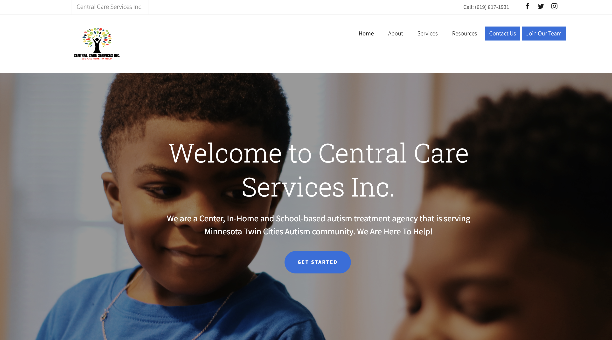

# Central Care Services 
A web application for an autism center displaying all of thier services. 

**Link to project:** https://centralcareservice.com/

## How It's Made:

**Tech used:** HTML, CSS, JS.

## Examples:
Take a look at these couple examples that I have in my own portfolio:

**BMI Calculator:** https://github.com/amunoali/StarTrekApi

**Portfolio:** https://github.com/amunoali/portfolio

**Drum Kit:** https://github.com/amunoali/JS-CodeWars

